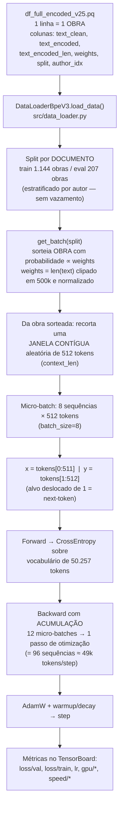
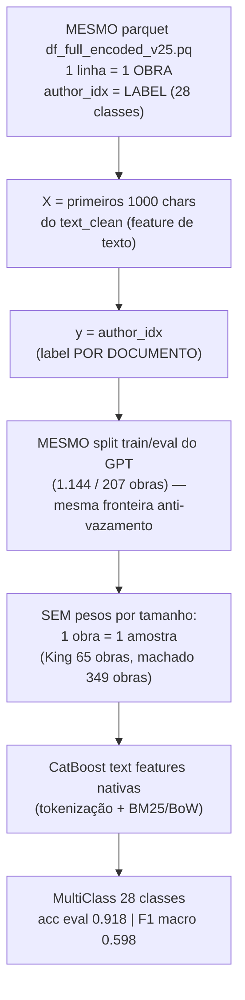

# Da base de texto aos batches — GPT vs Classificação de Autor

Documento de referência sobre como a base (`df_full_encoded_vXX.pq`) flui para o
modelo de linguagem (GPT) e como o MESMO dado deve ser repensado para o problema
de classificação de autor. Números reais da base **v25** (1.351 obras, 23,5M
tokens, 28 autores).

---

## Parte 1 — Fluxograma: base → batches no GPT

**Leitura do fluxo (o que importa):**

1. **Unidade atômica = a obra.** O parquet tem 1 linha por obra; o `split`
   (train/eval) é atribuído à obra inteira — nunca uma obra "divide" entre
   train e eval (sem vazamento).
2. **Amostragem por tamanho.** O `get_batch` sorteia obras com probabilidade
   proporcional ao comprimento (`weights`, clip 500k): obras longas (King)
   aparecem com mais frequência — é assim que o modelo "vê" o corpus em
   proporção de tokens, não de documentos.
3. **Janela, não a obra inteira.** De cada obra sorteada, um trecho contíguo
   de 512 tokens é recortado (posição aleatória a cada sorteio). O modelo
   nunca vê uma obra "inteira" — vê janelas.
4. **Batch = 8 janelas** (batch_size) com **gradiente acumulado em 12**
   micro-batches → passo efetivo de 96 sequências ≈ 49k tokens. É esse o
   número que define quantos tokens o modelo consome por update.
5. **Alvo = próximo token.** `y` é o `x` deslocado de uma posição; a loss é
   cross-entropy sobre o vocabulário. Não existe "label" no sentido de
   classificação.

---

## Parte 2 — Paralelo: a mesma base para classificação de autor

### Tabela comparativa

| Aspecto | GPT (geração de texto) | Classificação de autor |
|---|---|---|
| **Unidade** | obra (documento) | obra (documento) — mesma |
| **Label** | não há (next-token) | `author_idx` (28 classes) |
| **Feature de entrada** | `text_encoded` → janelas de 512 tokens | primeiros 1000 chars do `text_clean` |
| **Split** | por documento (train/eval) | **o mesmo split** (documento) |
| **Amostragem** | por `weights` ∝ tamanho (clip 500k) | uniforme por documento (1 doc = 1 amostra) |
| **Batch** | 8 janelas × 512 tokens (com grad_accum 12) | N documentos (sem janelas) |
| **Alvo (y)** | tokens deslocados de 1 | `author_idx` do documento |
| **Desbalanceamento** | mitigado pelos weights (tokens) | cru: por CONTAGEM de docs |
| **Métrica** | val loss / perplexidade | acc, F1 por autor |

### As 3 diferenças conceituais que mudam tudo

1. **O que "domina" a base é diferente em cada problema.**
   No GPT, a dominância é medida em **tokens**: King = 57% dos tokens (mas só
   65 obras / 4,8% dos docs). Na classificação, cada obra vale 1 amostra:
   quem domina é **machado = 349 obras (25,8% dos docs)**. Ou seja: o
   "desbalanceamento" inverte de sentido — o mesmo parquet, duas leituras.

2. **Weights servem ao GPT, não à classificação.**
   Amostrar a classificação por `weights` (∝ tamanho) distorceria a
   distribuição de classes por docs (as 5 obras do Poe virariam 5 "amostras
   enormes"). No classificador, 1 doc = 1 linha de (X, y); o balanceamento
   (se desejado) entra como estratégia posterior (class_weight, undersample
   do machado, etc.), não na amostragem de dados.

3. **O split é um contrato compartilhado.**
   Reutilizar o `split` do parquet garante: (a) nenhuma obra aparece em
   train e eval simultaneamente entre os dois modelos; (b) as métricas do
   classificador (0.918) são comparáveis com o GPT (val loss) sobre a
   MESMA fronteira de generalização. Mudar o split só para a classificação
   quebraria essa comparabilidade.

### Implicações práticas

- Para o classificador, o parquet já está pronto: `author_idx` (label) +
  `text_clean` (feature) + `split` (fronteira). Nada a re-gerar.
- Classes com poucas obras (teofilo 1, coelho_neto 4, pompeia 4) têm
  suporte insuficiente no eval — o F1 macro de 0.598 reflete isso (19 das
  28 classes têm < 5 docs no eval). Decisão de modelagem: agrupar classes
  raras, ou reportar só as classes com volume.
- Se um dia o classificador usar embeddings do próprio GPT (ex.: média dos
  últimos hidden states), a unidade continua sendo a obra — mas a entrada
  vira **pooling sobre as janelas**, não janelas soltas: mais um motivo
  para manter a fronteira de split idêntica.
